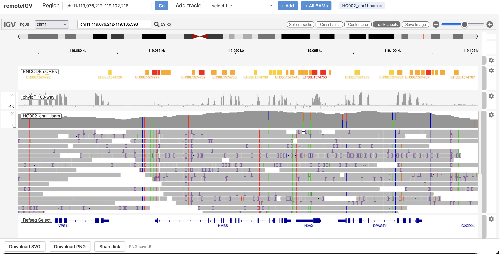

# remoteIGV

Browse BAM, CRAM, VCF, and BED files in your web browser,
without downloading them to your laptop.

remoteIGV is a lightweight web server that wraps [IGV.js](https://github.com/igvteam/igv.js) 
and serves your genomic files over HTTP with byte-range support. 
Point it at a directory of BAMs and open a browser. That's it.



## Quick start

If your BAMs live on a remote server you can SSH into,
one command from your laptop:

```bash
./run.sh user@yourserver:/data/bams
```

That's it. This copies the server over, starts it, tunnels the port,
and opens your browser. Ctrl+C to stop.

The remote only needs Python 3 and SSH access.

If you need an SSH key:

```bash
./run.sh -i ~/.ssh/my_key.pem user@yourserver:/data/bams
```

To avoid typing the key path every time:

```bash
export REMOTEIGV_SSH_OPTS="-i ~/.ssh/my_key.pem"
./run.sh user@yourserver:/data/bams
```

Custom port:

```bash
./run.sh user@yourserver:/data/bams 9999
```

## Local mode

If your BAMs are already on your machine:

```bash
./run.sh /path/to/your/bam/directory
```

All BAM/CRAM files with indexes are loaded automatically.
IGV.js streams just the bytes it needs via HTTP range requests,
so even multi-gigabyte BAMs load quickly.

## What you'll see

The browser opens with two genome-wide annotation tracks loaded automatically:

- **ENCODE cCREs** — regulatory regions (promoters, enhancers, etc.)
- **phyloP 100-way** — cross-species conservation scores

These are streamed directly from UCSC, so they work at any locus with no setup.

All BAM/CRAM files with indexes are loaded automatically.
Additional files appear in the **Add track** dropdown.
Type a gene name or coordinates into the **Region** box and press Enter to navigate.

## Supported file types

| Type | Extensions | Index |
|------|-----------|-------|
| Alignments | `.bam`, `.cram` | `.bai`, `.crai` |
| Variants | `.vcf.gz` | `.tbi` |
| Annotations | `.bed`, `.bed.gz`, `.gff.gz`, `.gtf.gz` | `.tbi` (for gzipped) |
| Quantitative | `.bw`, `.bigwig`, `.bedgraph` | — |

Index files (`.bai`, `.tbi`, etc.) should sit next to their data files. 
The server finds them automatically.

## Saving snapshots

The bottom bar has **Download SVG** and **Download PNG** buttons. 
These capture the current view; useful for figures or sharing with collaborators.

## Other environments

The core server is cloud-agnostic. It serves files from any local directory. 
The `aws/` scripts are just one deployment option.

### GCP / Azure

Mount your cloud storage as a local filesystem and point remoteIGV at it:

```bash
# GCP: mount a GCS bucket with gcsfuse
gcsfuse my-genomics-bucket /mnt/gcsdata
./run.sh /mnt/gcsdata

# Azure: mount Blob Storage with blobfuse2
blobfuse2 mount /mnt/azdata --tmp-path /tmp/blobfuse
./run.sh /mnt/azdata
```

### HPC / shared filesystems

If your BAMs already live on a shared filesystem (NFS, Lustre, GPFS), 
just point the server at them . No mounting needed:

```bash
# on an HPC login or interactive node
./run.sh /shared/lab/genomics 8080

# from your laptop, tunnel through the login node
ssh -N -L 8080:localhost:8080 hpc-login
```

If your HPC doesn't allow long-running processes on login nodes, 
request an interactive session or submit a job that 
runs `run.sh` and note the compute node hostname for the SSH tunnel.

### Docker

```bash
docker run --rm -p 8080:8080 -v /your/data:/data python:3.11-slim \
  bash -c "pip install fastapi uvicorn jinja2 && python server.py -d /data"
```

Or clone the repo into the container and use `run.sh`.

## Deploying to AWS

If your data lives on S3 or you want to share the viewer with others, 
there are scripts to deploy remoteIGV on an EC2 instance with 
S3 mounted as a local filesystem.

### Prerequisites

- AWS CLI configured (`aws configure`)
- An AWS account with permissions to create S3 buckets, 
EC2 instances, IAM roles, and security groups

### Configuration

All scripts read from `aws/config.sh` with sensible defaults. 
Override via environment variables or an `aws/.env` file:

```bash
# option A: env vars
REMOTEIGV_REGION=eu-west-1 REMOTEIGV_BUCKET=my-igv-data ./setup_aws.sh

# option B: .env file (not committed to git)
cat > aws/.env << 'EOF'
REMOTEIGV_REGION=eu-west-1
REMOTEIGV_BUCKET=my-igv-data
REMOTEIGV_INSTANCE_TYPE=t3.micro
EOF
```

Available settings: `REMOTEIGV_REGION`, `REMOTEIGV_BUCKET`, 
`REMOTEIGV_PORT`, `REMOTEIGV_INSTANCE_TYPE`, `REMOTEIGV_KEY_NAME`.

### Step 1: Create AWS resources

```bash
cd aws
./setup_aws.sh
```

This creates:
- An S3 bucket (default: `remoteigv-data`) for your genomic files
- An IAM role so the EC2 instance can read from S3
- A security group allowing SSH and port 8080 from your current IP
- An SSH key pair saved to `~/.ssh/remoteigv-key.pem`

Safe to re-run — it skips anything that already exists.

### Step 2: Upload data

```bash
./upload_test_data.sh
```

This downloads a small HG002 BAM (~736 KB) from igv.js test data 
and fetches annotation tracks (MANE Select genes, ENCODE cCREs, phyloP conservation) 
from the UCSC Genome Browser API, then uploads everything to S3.

To use your own data instead, upload BAM/VCF/BED files to 
`s3://remoteigv-data/` using `aws s3 cp`.

### Step 3: Deploy

```bash
./deploy.sh
```

This launches a t3.small EC2 instance, mounts the S3 bucket via 
[mountpoint-s3](https://github.com/awslabs/mountpoint-s3), 
and starts the server. It prints the URL when ready.

### Managing the instance

```bash
./deploy.sh --stop      # stop the instance (saves ~$0.02/hr, keeps your data)
./deploy.sh --start     # restart a stopped instance
./deploy.sh --redeploy  # push updated code to running instance
```

### Tearing down

```bash
./teardown_aws.sh
```

Removes all AWS resources (EC2, S3, IAM, security group, SSH key). 
Prompts before each deletion. Pass `--yes` to skip prompts.

## Project structure

```
.
├── run.sh                  # local quick start
├── server.py               # FastAPI server with range request support
├── templates/index.html    # IGV.js frontend
├── requirements.txt        # Python dependencies
└── aws/
    ├── config.sh           # shared settings (region, bucket, etc.)
    ├── setup_aws.sh        # create AWS resources
    ├── upload_test_data.sh # upload demo data to S3
    ├── deploy.sh           # launch/manage EC2 instance
    └── teardown_aws.sh     # clean up everything
```

## Citation

remoteIGV is built on IGV.js. If you use it in published work, please cite:

> Robinson JT, Thorvaldsdóttir H, Turner D, Mesirov JP. igv.js: an embeddable JavaScript implementation of the Integrative Genomics Viewer (IGV). *Bioinformatics*. 2023;39(1):btac830. doi:[10.1093/bioinformatics/btac830](https://doi.org/10.1093/bioinformatics/btac830)
